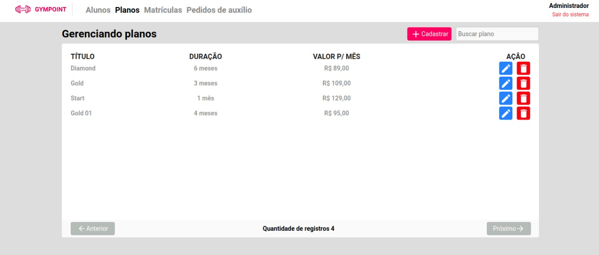

<h1 align="center">
  
</h1>

<h3 align="center">
  Desafio final do BootCamp GoStack
</h3>

## Sobre o projeto

Gympoint é uma aplicação para o gerenciamento de academias. Desenvolvido ultilizando as tecnologias mais em alta no mercado,
<b>NodeJs no backend, ReactJs no frontend e React-Native no mobile.</b><br />
A aplicação WEB, foi desenvolvida para o administrador, onde o mesmo pode lidar com todos os CRUDs disponíveis e ainda 
responder as dúvidas que os alunos enviam. <br />
A aplicação mobile foi desenvolvida para o aluno. Ele pode fazer check-ins na academia ( até 5 por semana ), vizualizar seu perfil,
ver respostas das suas perguntas e enviar perguntas.
<br /><br />
## demonstração


<b>Aplicação web</b>

<br/>
<b>Aplicação mobile</b>

## Configuração
<br/><br/>
O banco de dados usado foi o Postgres, usando o sistemas de container do docker. Para isso é preciso baixar
e configurar o Docker com o postgres.

Dowload docker: <a href="https://hub.docker.com/">Docker</a>


Abaixo o comando para installar o postgres da maneira correta

<br/>

```
docker run --name database -e POSTGRES_PASSWORD=docker -p 5432:5432 -d postgres:11
```

Depois inicie o container:

```
docker start database
```

Agora para facilitar a criação da base de dados, instale o PostBird: 

Download PostBird: <a href="https://electronjs.org/apps/postbird/">PostBird<a/>
<br />
A aplicação usa um sistema de envio de email automático <a href="https://mailtrap.io/">MailTrap</a>. Crie uma conta para poder ter acesso aos emails.
<br />

Clone o repositório.

```
git clone https://github.com/jmnsingle/Gympoint
```

<br />

### Instruções para o backend

Vá para a pasta root e instale as dependencias:

```
cd Gympoint/backend
yarn
```

Acesse o arquivo `.env.example` e veja as variáveis de ambiente. Crie um arquivo `.env` e preencha de acordo. 
Digite os seguintes comandos para a criação das migrations:

```
yarn sequelize db:migrate
yarn sequelize db:seed:all
```

Para o envio de email, acesse a pasta `src/config/mail.js` e coloque as suas credenciais do  <a href="https://mailtrap.io/">MailTrap</a>.


E então, basta digitar o comando abaixo para iniciar o backend:

```
yarn dev
```

Você pode baixar o <a href= "https=//insomnia.rest/">Insomnia</a> para testar a aplicação.

<br />

### Instruções para o Frontend

Vá para a pasta root e instale as dependencias:

```
cd Gympoint/frontend
yarn
```
Iniciando o frontend:

```
yarn start
```

Use `admin@gympoint.com` como email e `123456` como senha.

<br />

### Instruções para o mobile.

Vá para a pasta root e instale as dependencias:

```
cd Gympoint/mobile
yarn
```

<b>OBS: A aplicação mobile foi testada apenas na plataforma android.</b>

Acesse o arquivo `api.js` na pasta `src/services` e altere o IP para o IP da sua máquina.

Então, inicie a aplicação:

```
react-native run-android
```

## Imagens

### Web

<p float="left">
  
  
  
  
  
  
  
  
  
  
</p>

### Mobile

<p float="left">
  
  
  
  
  
  
</p>
